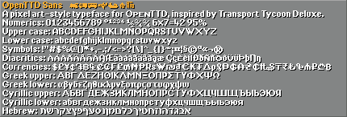

# OpenTTD TrueType typefaces

TrueType typefaces for text in a pixel art style, designed for use in OpenTTD. Drawn to broadly capture the look and feel of the pixel fonts in Transport Tycoon Deluxe.

These typefaces have a pixel-perfect appearance when rendered a specific height (or multiples thereof).

TTFs available to download from [Releases](releases/).

## Faces

### OpenTTD Sans

Heavy sans serif designed for use for dense medium-sized text.
Designed for use at 10 pixel height.




Full coverage of: `Basic Latin`, `Latin-1 Supplement`, `Latin Extended-A` and `Currency Symbols`.
Extensive coverage of: `Greek and Coptic`, `Cyrillic` and `Hebrew`.

### OpenTTD Mono

Heavy sans serif monospace designed for dense medium-sized code.
Designed for use at 10 pixel height.


Full coverage of: `Basic Latin`, `Latin-1 Supplement`, `Latin Extended-A` and `Currency Symbols`.
Extensive coverage of: `Greek and Coptic` and `Cyrillic`.

### OpenTTD Serif

Light serif designed for use in sparse large text.
Designed for use at 18 pixel height.


Full coverage of: `Basic Latin`, `Latin-1 Supplement`, `Latin Extended-A` and `Currency Symbols`.
Extensive coverage of: `Greek and Coptic`, `Cyrillic` and `Hebrew`.

### OpenTTD Small

Specialised very small size typeface for use in small text. Comes in two variants, normal or all capitals.
Designed for use at 6 pixel height.


Full coverage of: `Basic Latin`, `Latin-1 Supplement`, `Latin Extended-A`, `Currency Symbols`.
Extensive coverage of: `Greek and Coptic`, `Cyrillic` and `Hebrew`.

## Using in OpenTTD

If you are using OpenTTD 14.0 or later, these come included with the game.
They are enabled by default, and you can toggle them using `Game Options > Graphics > Use traditional sprite font`.

### Manual installation

If you would like to manually install them then follow these instructions.
This lets you use the latest updates, use thm in older versions of OpenTTD, use custom size/style combinations, etc. 

1. Download the typeface (font) TTF files from [Releases](releases/).
2. Install as normal for your operating system. In Windows, double-click on the TTF file to open it, then click "Install" in the top left.
3. Set up OpenTTD to use the fonts. In your [openttd.cfg](https://wiki.openttd.org/en/Archive/Manual/Settings/Openttd.cfg) file, change the font settings to the following:

```
small_font = OpenTTD Small
medium_font = OpenTTD Sans
large_font = OpenTTD Serif
mono_font = OpenTTD Mono
small_size = 6
medium_size = 10
large_size = 18
mono_size = 10
small_aa = true
medium_aa = true
large_aa = true
mono_aa = true
```

If you want a more pixel-art apperance then set `small_aa`, `medium_aa`, `large_aa` and `mono_aa` to `false`.

If you want the text in-game to appear larger, it is best to use the "Interface size" setting in "Game Options > Graphics". You can also change the font size in your `openttd.cfg` - for best results stick to multiples of `6`, `10`, `18` and `10` respectively.

To uninstall, just remove the font names from the `small_font`, `medium_font`, `large_font` and `mono_font` entries in `openttd.cfg`:
```
small_font = 
medium_font = 
large_font = 
mono_font = 
```

## Mistakes and Bugs

There might be mistakes or bugs, if you spot any problems please let us know! The fonts were developed by a native English speaker, so the non-standard Latin alphabet and diacritics are where you are most likely to find errors. The best way to report problems is is using Github Issues.

## Building
Run `make all` to build the output TTF files and re-generate the image previews. These are placed in the `ttf` directory.
Requires `FontForge` and `Python`. `Python` requires `PIL`. Developed and tested using `WSL`.

The master source files are the Fontforge SFD file. SVG files of individual glyphs are provided for convenience and not automatically imported.

We provide a set of font previews `png` images. Please periodically run `make preview` to update these previews, for example for a commit prior to a release.
